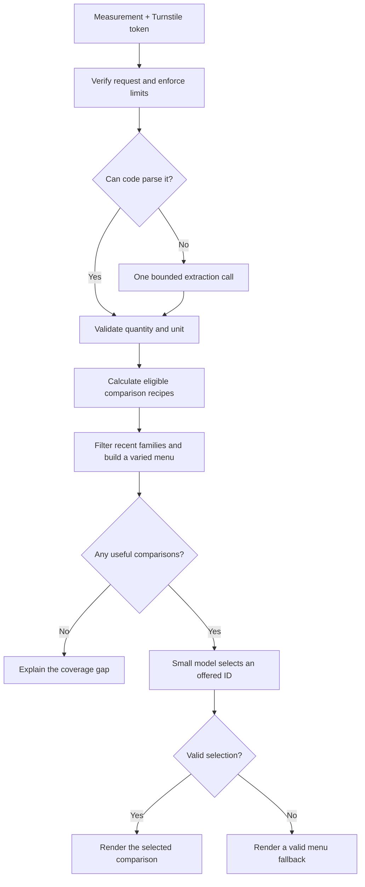

# How the converter works

Anything But Metric separates measurement interpretation, arithmetic and comparison selection. The small model chooses from complete, calculated answers. It has no authority to change their quantities, source facts or displayed wording.

## Contracts between stages

| Stage | Responsibility | Boundary |
| --- | --- | --- |
| Local parser | Recognize supported units, harmless typos, fractions and mixed measurements | Preserve the full input; reject invalid values |
| Prose extractor | Return a quantity and unit when local parsing cannot resolve the input | Llama 3.1 8B, one attempt, 128 output tokens, five-second deadline |
| Comparison builders | Apply fixed formulas to reviewed facts and preserve their assumptions | Code owns arithmetic, source ranges and scale limits |
| Menu | Mix mechanisms and avoid recent source families | At most six candidates; at most eight history slugs |
| Selector | Choose a clear, fun comparison | Llama 3.2 3B, offered-ID schema, 256 output tokens, five-second deadline |
| Renderer | Display a complete code-owned answer | Exact ID only; reject extra model-authored fields |

Ordinary literals use one model call. Unresolved prose can use two. A failed selector uses an eligible menu item with no retry. A failed extractor or empty menu returns an explicit error. Zero and absolute temperatures have their own semantics; they are not forced into a positive ratio.

## AI-token inputs

A complete AI-token count takes a local path before physical-unit interpretation. Two sourced GPU-energy rates produce an interval; code joins matching appliance comparisons at both endpoints. The ordinary menu, selector and fallback then apply. One candidate skips selection entirely. The required estimate label and output-token assumption travel with the answer, including fallback results. See [AI-token estimates](ai-tokens.md) for scope and exclusions.

## Facts and creative compositions

`src/data/` contains 94 point references, six composition anchors, six data formats and three animal ranges. Recipes can count equivalent objects, lift them, compare ideal motion, run appliances, cover an area or allocate encoded data across a fixed ensemble. The printed-data recipe defines its own duplex hexadecimal layout and uses sourced paper thickness and Earth diameter.

The reference's size stays independent of the submitted measurement. Published intervals retain both endpoints. A power specification only participates in a physical recipe when its role supports that recipe. An imagined scene does not assert that the object can survive it or the venue can supply its electricity.

Prepared builders validate and snapshot the static inventory once per Worker isolate. Each result carries a headline, interpreted input, short explanation, full basis and source links. The interface displays those details using text nodes, not model-supplied HTML.

## Variety and model choice

The browser keeps recent families in memory and includes them in the next request. Code filters all source families across representations before choosing the small menu. The oldest exclusions relax only when they exclude everything available. Reloading starts a fresh session; there is no server-side conversation or persistent history store.

Llama 3.2 3B is the current selector because small development comparisons made it a promising cost-and-latency choice. That evidence does not establish universal superiority. Model or prompt changes should be tested on the same frozen menus, with correctness, clarity, variety, latency and cost measured separately. A larger model cannot repair a missing reference.

## Hosting and protection

Astro produces static assets. One Cloudflare Worker serves `/api/convert` and the assets. The AI binding calls an authenticated AI Gateway with caching bypassed. Server-side Turnstile validation checks the expected hostname and action. The Worker applies a 10-request-per-minute client limit, 8 KiB body limit, 500-character measurement limit and 20 ms CPU limit.

The production gateway is configured separately with spend controls. Skopia receives visit analytics and successful conversion events containing only the dimension. There is no application database. Provider infrastructure and access logging have their own behavior; dimension-only product analytics is not a claim that submitted measurements never reach a provider.

## Where to look

- `src/worker.ts`: request handling, verification and bounded inference.
- `src/lib/measurement.ts`: local interpretation.
- `src/lib/comparison-flow.ts`: production menu, selector contract and public response.
- `src/lib/scene-packets.ts`: compositions and salience bounds.
- `src/lib/range-scenes.ts`, `motion-anchors.ts`, `printed-data.ts`: additional representations.
- `src/pages/index.astro`: interface, Turnstile lifecycle and source details.
- `test/` and `evals/`: regression tests and frozen development fixtures.
