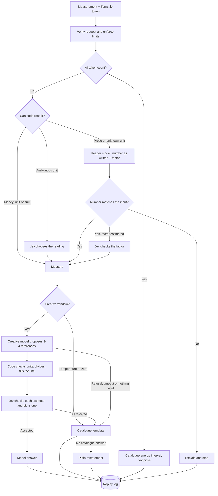

# How the converter works

Anything But Metric is model-led. A creative model proposes things to compare with and estimates how big one of each is. Jev, TypeSafe's decision model, checks those estimates and chooses the comparison. Code does only the arithmetic: unit factors and one division. The reviewed catalogue in `src/data/` is the fallback when the creative step fails or refuses, and a plain restatement of the measure covers what the catalogue cannot.

```mermaid
flowchart TD
  A[Measurement + Turnstile token] --> B[Verify request and enforce limits]
  B --> T{AI-token count?}
  T -->|Yes| TC[Catalogue energy interval; Jev picks]
  T -->|No| C{Can code read it?}
  C -->|Money, unit or sum| E[Measure]
  C -->|Ambiguous unit| J1[Jev chooses the reading]
  C -->|Prose or unknown unit| D[Reader model: number as written + factor]
  J1 --> E
  D --> N{Number matches the input?}
  N -->|No| X[Explain and stop]
  N -->|Yes, factor estimated| J2[Jev checks the factor]
  N -->|Yes| E
  J2 --> E
  E --> W{Creative window?}
  W -->|Temperature or zero| F[Catalogue template]
  W -->|Yes| G[Creative model proposes 3-4 references]
  G --> H[Code checks units, divides, fills the line]
  H --> J3[Jev checks each estimate and picks one]
  J3 -->|Accepted| R[Model answer]
  J3 -->|All rejected| F
  G -->|Refusal, timeout or nothing valid| F
  F -->|No catalogue answer| P[Plain restatement]
  R & F & P & TC & X --> L[(Replay log)]
```

## Contracts between stages

| Stage | Responsibility | Boundary |
| --- | --- | --- |
| Local reader | Money symbols, codes and words; supported units, typos, fractions, sums; ambiguous unit words | Preserves the full input; rejects invalid values without a model call |
| Reader model | Prose and units code does not know: the number as written, the kind (physical, money or count) and what one written unit equals | GLM 5.3 Flash at low reasoning effort, 600 output tokens, six seconds. Its number must be one the person typed. Code's own factor wins for units it knows |
| Jev reading | Picks among readings of `pounds`, `oz`, `ton`, `gallon`, `pint` and `cup` | One choice question; Math.js's default reading if Jev is unavailable |
| Jev estimate | Checks any unit factor code did not supply and any named quantity ("the height of Everest") | Seven half-decade bands; a value more than one band off is replaced with the centre of Jev's band |
| Creative model | Proposes three or four references, each with a value, unit, basis, family and a line containing `{N}` | GLM 5.3 Flash, reasoning low, up to 15 seconds. It sees the measurement's decade, a theme, the families to avoid and the person's words as context, never the exact count |
| Code | Converts units, divides, checks the 0.1–1,000 count range and the number-match gate, fills `{N}` | The only arithmetic. Money divides only by the same currency; counts by the counted item |
| Jev review | One band question per valid proposal plus a pick question | Proposals more than one band (about ×3) from Jev's view are dropped; the pick decides among the rest |
| Template | Catalogue menu for the same measure, Jev picks | Used on refusal, failure, deadline or when Jev rejects every proposal. When the catalogue has no answer (money, counts, derived dimensions, out-of-catalogue scales), the result restates the measure plainly (physical measures in SI units) |

The whole flow has a 25-second budget, inside the page's 30-second limit. A step that would overrun it is skipped and recorded as `skipped_deadline`. Without a configured Jev route, or when code cannot read Jev's reply (recorded as `unreadable`), the flow still answers: readings fall back to the default, estimates and proposals are used unchecked, and the result says so.

## The number-match gate

The creative model writes its line before the count exists, with one `{N}` placeholder. Code computes the count and fills it in, so the displayed number is always code's. The gate rejects a line with another digit or number word, a second placeholder, markup, a missing reference name or refusal wording. The reader's number gets the same treatment: it must equal a number the person typed, optionally scaled by a number word they also typed ("3 million").

## What can be measured

Any Math.js unit, including dimensions outside the catalogue such as voltage, density or acceleration; money in 26 currencies, never converted between currencies; counts of named things, including food portions ("3 slices of pizza", "a dozen eggs"); and named quantities with no number, which the reader estimates and Jev checks. Temperatures and zero use the catalogue, then the plain restatement; AI-token counts use the catalogue only. Results with model estimates say so in the assumption and in the basis.

## Facts and creative compositions

`src/data/` still contains 94 point references, six composition anchors, six data formats and three animal ranges, used by the template fallback and the AI-token path. See the catalogue's recipes in `src/lib/scene-packets.ts`, `range-scenes.ts`, `motion-anchors.ts` and `printed-data.ts`. Each catalogue result carries sourced links; model results carry their estimate and arithmetic instead.

## Variety

The browser keeps recent families in memory and sends them with the next request. The creative model receives them as `avoid`; the template menu filters them as before. Each request also gets a random theme. Reloading starts a fresh session.

## Replay log

Every verified request writes one `abm-replay.v1` row to the D1 database `anything-but-metric-replay`: the measurement text, each stage's model, prompt version, input, raw response (bounded), outcome and latency, Jev's questions and answers, and the final answer or error. Refusals, rejections and fallbacks are logged as well as answers. The IP address and Turnstile token are not stored. Rows are deleted within a day of turning 30 days old: every write and a daily Cron Trigger prune them. `npm run replay` pulls rows and rescores them with current code; see [Evaluation](evaluation.md#production-replay).

Workers Logs gets one summary line per request with stage outcomes and latencies but no measurement text.

## Hosting and protection

Astro produces static assets. One Cloudflare Worker serves `/api/convert` and the assets. Workers AI calls use the AI binding through the authenticated `anything-but-metric` AI Gateway with caching bypassed. Jev calls go to the same gateway's custom OpenRouter route with the gateway token; the gateway adds the stored OpenRouter key. Server-side Turnstile validation checks the expected hostname and action. The Worker applies a 10-request-per-minute client limit, 8 KiB body limit, 500-character measurement limit and 20 ms CPU limit.

Skopia receives visit analytics and conversion events containing only the dimension.

## Where to look

- `src/worker.ts`: request handling, verification and the model transports.
- `src/lib/model-flow.ts`: the production flow and replay record.
- `src/lib/measures.ts`: money, counts, ambiguous units and the division.
- `src/lib/reader.ts`, `creative-proposals.ts`, `jev-decisions.ts`: each model's contract.
- `src/lib/replay-log.ts` and `migrations/`: the replay log.
- `src/lib/comparison-flow.ts` and the scene modules: the catalogue fallback.
- `test/` and `evals/`: regression tests and frozen evaluation sets.
